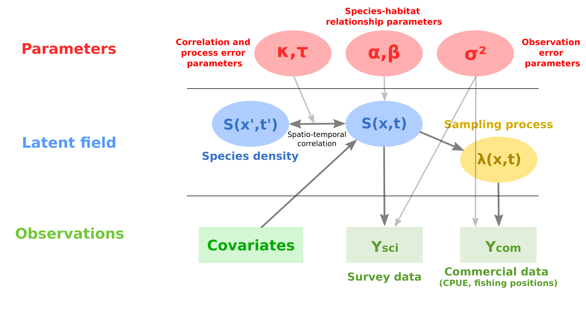

```{r setup, include=FALSE}

knitr::opts_chunk$set(echo = FALSE)

library(dplyr)
library(fields)
library(INLA)
library(maps)
library(RandomFields)
library(sf)
library(sp)
library(spatstat)

```

# Modélisation spatiale, approche SPDE et INLA

## Modéle hiérarchique spatial

{width=105%}

### Champ gaussien

```{r,echo=FALSE,warning=FALSE}

RFoptions(spConform=FALSE)

## Modèle exponentiel
model <- RMexp(var=5, scale=10) + # variance 4 and scale 10
  RMnugget(var=0.1) + #  effet pépite
  RMtrend(mean=0.5) # moyenne

## définition des localisations
from <- 0
to <- 20
x.seq <- seq(from, to, length=200)
y.seq <- seq(from, to, length=200)

simu <- RFsimulate(model, x=x.seq, y=y.seq)

image.plot(x.seq,y.seq,simu,xlab="",ylab="",asp=1)

```

---

\Large
$$x | \theta \sim GF(\mu,\Sigma) \quad \quad \text{champ gaussien}$$
\vspace{\baselineskip}

\normalsize

- $\Sigma = Q^{-1}$: la matrice de variance-covariance de l'effet aléatoire (suit une certaine fonction de variance-covariance - souvent de type Matérn). $Q$ est la matrice de précision.


### Formulation mathématique

$$\theta \sim \pi(\theta) \quad \quad \text{hyperparamètres}$$

$$x | \theta \sim GF(0,\Sigma) \quad \quad \text{champ gaussien latent}$$

$$y | x, \theta  \sim \prod_i \pi(y_i | \eta_i(x),\theta) \quad \quad \text{processus d'observation}$$ 


\small

\vspace{\baselineskip}

\begin{itemize}

\item $y$: les observations
\item $\theta$: les hyperparamètres
\item $\Sigma = Q^{-1}$: la matrice de variance-covariance de l'effet aléatoire (suit une certaine fonction de variance-covariance - souvent de type Matérn). $Q$ est la matrice de précision.
\item $\eta(x) = Ax$ un processus gaussien avec $A$ la matrice d'observation

\end{itemize}

\pause

\center \textbf{La difficulté : estimer la structure de corrélation spatiale ($\Sigma$ ou $Q$).}

## 1er approximation : Approche SPDE

\begin{itemize}
\item Principe de l'approche SPDE (Lindgren, Rue and Lindström, 2011) :
  \begin{itemize}
  \item 1 champ gaussien de covariance une fonction de Matérn ...
  \item ... est solution de l'EDPS ...
  $$\left(\kappa^{2}-\Delta\right)^{\alpha / 2} x(s)=W(s), \quad s \in \mathbb{R}^{d}, \quad \alpha=\nu+d / 2, \quad \kappa>0, \quad \nu>0$$
  \item ... et peut être représenté comme un champ Gauss-Markov (seulement pour certaines valeurs de $\nu$)
  \end{itemize}
\item Ce lien entre champ Gaussien et champ Gauss-Markov fournit une représentation creuse de l'effet spatial et simplifie les calculs.
\end{itemize}

\vspace{\baselineskip}

\small Notations : $\Delta$ le laplacien, $W(s)$ un bruit blanc gaussien, $\kappa$ le paramètre contrôlant la portée de l'effet aléatoire, $\nu$ et $\alpha$ les paramètres de lissage, $d$ le nombre de dimension (2). 

---

\small

Pour des valeurs données de $\nu$, les champs Gauss-Markov génèrent des solutions approchées de l'EDPS. Les matrices de précisions de ces champs Gauss-Markov peuvent être utilisées pour formuler les matrices de précisions des champs gaussiens. Par exemple :

\begin{itemize}
  \pause
  \item pour $\nu = 1$ , la matrice de précision s'écrit :
  $$\begin{pmatrix}{}
1 & & \\
-2 a & 2 & \\
4+a^{2} & -2 a & 1
\end{pmatrix}$$
  \pause
  \item pour $\nu = 2$ :
  $$\begin{pmatrix}{}
-1 & & \\
3 a & -3 & \\
-3\left(a^{2}+3\right) & 6 a & -3 \\
a\left(a^{2}+12\right) & -3\left(a^{2}+3\right) & 3 a & -1
\end{pmatrix}$$  
  \pause
  \item La matrice est de moins en moins creuse ; l'effet aléatoire en un point dépend d'un voisinage plus étendu.

\end{itemize}

---

\center
{width=75%}


## 2e approximation : INLA


La probabilité conjointe du champ latent et des hyperparamètres s'écrit :
$$\pi(x, \theta | y) \propto \pi(\theta) \pi(x | \theta) \pi(y | x, \theta) \propto \pi(\theta) \pi(x | \theta) \prod_{i \in \mathcal{I}} \pi\left(y_{i} | x_{i}, \theta\right)$$ 

avec $\theta$ : les paramètres, $x$ : le champ latent, $y$ : les observations 

\pause
\begin{center} 
\textbf{\ding{220} \, Long à estimer (via des méthodes type MCMC)}
\end{center}
\vspace{\baselineskip}

\pause

La méthode INLA consiste à approximer les distributions marginales $\pi(\theta | y)$ et $\pi\left(x_{i} | \theta, y\right)$ :


\begin{itemize}

\vspace{\baselineskip}

\item $\tilde{\pi}\left(x_{i} | y\right)=\int \tilde{\pi}\left(x_{i} | \theta, y\right) \tilde{\pi}(\theta | y) d \theta$

\vspace{\baselineskip}

\item $\tilde{\pi}\left(\theta_{j} | y\right)=\int \tilde{\pi}(\theta |y) \mathrm{d} \boldsymbol{\theta}_{-j}$

\end{itemize}

## Bilan


\vspace{\baselineskip}

- INLA : Estimation des lois marginales des effets aléatoires et des hyperparamètres par des approximations de Laplace emboitées

- Approche SPDE (1er résultats) : Approximation d'un champ gaussien par un champ Gauss-Markov

\begin{center} \ding{220} Valide pour des champs latents gaussiens \end{center}

\vspace{\baselineskip}

- Approche SPDE (2e résultats) : Interpolation linéaire pour relier le champ gaussien (définie sur une maille discrète) aux observations (définies sur un domaine continu) 

\begin{center} \ding{220} Attention à la construction de la maille \end{center}


# Exemple qualité de l'aire

```{r chargement des données, echo=F, warning=FALSE, message=FALSE, tidy=TRUE}

load("data/OBS_2014.RData")
OBS_daily2014=OBS_daily2014[OBS_daily2014$type_of_station=="Background",]
dates=as.Date(OBS_daily2014$date)
OBS_daily2014$day=1+as.integer(difftime(OBS_daily2014$date,OBS_daily2014$date[1],units='days'))

```

## Données

```{r représentations des données, echo=F, warning=FALSE, message=FALSE, tidy=TRUE}

xy_OBS=SpatialPoints(coords=OBS_daily2014[,c("long","lat")],proj4string=CRS("+init=epsg:4326"))
xy_OBS=spTransform(xy_OBS,CRS("+init=epsg:2154"))@coords/10^6

# Frontière des coordonnées du territoire francais
fr=map("world",regions="france",plot=FALSE)

# Transformations des coordonnées en Lambert 93 (fonction spTransform)
xy_fr = SpatialPoints(coords=na.omit(cbind(fr$x,fr$y)),proj4string=CRS("+init=epsg:4326"))
xy_fr = spTransform(xy_fr,CRS("+init=epsg:2154"))@coords/10^6
fr$x[!is.na(fr$x)] = xy_fr[,1]
fr$y[!is.na(fr$y)] = xy_fr[,2]

# Plot des observations sur le territoire francais
plot(unique(xy_OBS),pch=19,cex=.33, asp = 1, xlab = "x (1000 km)", ylab = "y (1000 km)")
lines(fr$x,fr$y,lwd=2)

```


## Création de la mesh

```{r création de la mesh, echo=FALSE, warning=FALSE}

bound  = inla.nonconvex.hull(unique(xy_OBS),convex=-.05)
bound2 = inla.nonconvex.hull(unique(xy_OBS),convex=-.2)
plot(rbind(bound2$loc,bound2$loc[1,]),type="l", asp = 1, xlab = "x (1000 km)", ylab = "y (1000 km)")
lines(rbind(bound$loc,bound$loc[1,]))
points(unique(xy_OBS),pch=19,cex=.25)

# Longueur minimale des arêtes: 10km. Longueur maximale des arêtes: 25km 
# (sur le domaine d'étude) and 50km (dans la zone d'extension).
mesh=inla.mesh.2d(loc=unique(xy_OBS),boundary=list(bound,bound2),cutoff=.01,
                  max.edge=c(.025,.5),min.angle=c(21,21))
plot(mesh, asp = 1, xlab = "x (1000 km)", ylab = "y (1000 km)",add=T)
lines(fr$x,fr$y,lwd=2,col="red")
points(unique(xy_OBS),pch=19,cex=.66, asp = 1, col = "orange")

```


## Construction de l'objet SPDE

\small

```{r  Construction objet SPDE, echo=TRUE, warning=FALSE}

myspde=inla.spde2.pcmatern(mesh=mesh,
                           alpha=2,
                           prior.range=c(.01,.1),
                           prior.sigma=c(25,0.5))

# Matrice d'observation pour faire le lien
# entre les noeuds de la mesh et les points d'observation
A=inla.spde.make.A(mesh,loc=xy_OBS)

# Vecteur des indices pour les noeuds de la mesh
idx.spatial=inla.spde.make.index("spatial",
                                 n.spde=mesh$n)

```

\normalsize

## Construction du modèle de régression

Premièrement, on construit un dataframe de covariable.

\small

```{r Construction du modèle de régression, echo=TRUE, warning=FALSE}

covar.df=data.frame(intercept=1,
                    x=xy_OBS[,1],
                    y=xy_OBS[,2])

# Creation du stack pour les données et les indices
mystack=inla.stack(data=list(pm10=OBS_daily2014$PM10),
                   A=list(A,1),
                   effects=list(idx.spatial,covar.df))

# Ecriture des formules du modèle
myformula=pm10~-1+intercept+f(spatial,model=myspde)

```

\normalsize

N.b.: comme on écrit l'intercept de facon explicite, on doit inclure "-1" dans l'expression du modèle.


## Ajustement du modèle avec R-INLA

\small

```{r Ajustement du modèle, echo=TRUE, eval = FALSE, warning=FALSE}

fit=inla(myformula,
         data=inla.stack.data(mystack),
         family="gaussian", 
         control.predictor=list(A=inla.stack.A(mystack),
                                compute=FALSE),
         control.inla=list(int.strategy="eb",
                           strategy="gaussian"),
         verbose=FALSE)

summary(fit)

``` 

\normalsize

---

\tiny

```{r,echo = F}

load("res/fit_air_pollution.RData")
summary(fit)

```

\normalsize

## Predictions avec R-INLA

Pour calculer les predictions, la donnée d'entrée (`inla.stack`) doit être un peu modifié. On ajoute des valeurs NA au vecteur d'observations et INLA prédit les valeurs du champ latent sur ces points.

\tiny

```{r Construction des objets pour calculer les prédictions, echo=TRUE, warning=FALSE}

# Construction de la grille de projection
proj_grid=inla.mesh.projector(mesh,
                              xlim=range(bound$loc[,1]),
                              ylim=range(bound$loc[,2]),
                              dims=c(100,100))

xygrid=as.matrix(expand.grid(proj_grid$x,proj_grid$y))

# Construction la matrice de projection
A=inla.spde.make.A(mesh,
                   loc=rbind(xygrid,xy_OBS))


covar.df=data.frame(intercept=1,
                    x=c(xygrid[,1],
                        xy_OBS[,1]),
                    y=c(xygrid[,2],
                        xy_OBS[,2]))

# Creation du stack avec toutes les données et les indices: on ajoute des NA dans le vecteur d'observation
mystack=inla.stack(data=list(pm10=c(rep(NA,nrow(xygrid)),
                                    OBS_daily2014$PM10)),
                   A=list(A,1),
                   effects=list(idx.spatial,covar.df),
                   tag="mytag")
```

\normalsize

---

\small

Lors de l'ajustement, on spécifie l'argument `compute=TRUE` (pour calculer les valeurs ajustées et les valeurs prédites) et `link=1`.

\tiny
\vspace{\baselineskip}

Le temps de calcul peut être beaucoup plus long puisque R-INLA calcule aussi les prédictions sur l'ensemble de la grille.
\small

```{r Prediction avec les posteriors, echo=TRUE, eval=FALSE, warning=FALSE}
fit=inla(myformula,
         data=inla.stack.data(mystack),
         family="gaussian",
         control.predictor=list(A=inla.stack.A(mystack),
                                compute=TRUE,
                                link=1),
         control.inla=list(int.strategy="eb",
                           strategy="gaussian"),
         verbose=FALSE)
```

\normalsize

---

```{r Moyennes des prédictions, echo=FALSE, warning=FALSE}

# Indices des valeurs prédites (il y a plusieurs manières de faire ca...):
idx.pred=inla.stack.index(mystack,tag="mytag")$data[1:nrow(xygrid)]

# On extrait les prédictions puis on les plot
pred.grid=fit$summary.fitted.values$mean[idx.pred]
image.plot(proj_grid$x,proj_grid$y,matrix(pred.grid,ncol=100,nrow=100), asp = 1, xlab = "x (1000 km)", ylab = "y (1000 km)")
points(unique(xy_OBS),pch=19,cex=.25)
lines(fr$x,fr$y,lwd=2)

```

---

```{r Erreur standard des prédictions, echo=FALSE, warning=FALSE}

# On extrait et on plot l'erreur standard des predictions
pred.grid=fit$summary.fitted.values$sd[idx.pred]
image.plot(proj_grid$x,proj_grid$y,matrix(pred.grid,ncol=100,nrow=100), asp = 1, xlab = "x (1000 km)", ylab = "y (1000 km)")
points(unique(xy_OBS),pch=19,cex=.25)
lines(fr$x,fr$y,lwd=2)

```

---

```{r Résiduess, echo=FALSE, warning=FALSE}

n.data=nrow(OBS_daily2014) # nb de données
idx.data=inla.stack.index(mystack,tag="mytag")$data[(nrow(xygrid)+1):(nrow(xygrid)+n.data)]
resid=OBS_daily2014$PM10-fit$summary.fitted.values$mean[idx.data]
hist(resid,breaks=100,freq=F)

prec2sd=function(prec){ # fonction pour transformer la précision en erreur standard
  sqrt(1/prec)
}

sd.likelihood=inla.emarginal(prec2sd,marginal=fit$marginals.hyperpar$`Precision for the Gaussian observations`)
xvals=-500+1:1000
lines(xvals,dnorm(xvals,sd=sd.likelihood),col="blue",lwd=2)

```


## Exercice ?

- Ajout de covariables au modèle (i.e. prédicteurs linéaires comme variable explicative)

- Evaluation/comparaison de modèles

- Passage à un modèle spatio-temporel

- Construction d'un modèle intégré (plusieurs sources de données)


# Quelques références utiles

\begin{columns}
\begin{column}{0.33\textwidth}

\centering
\includegraphics[width = 3cm]{"images/book_rinla_4.jpg"}

\end{column}
\begin{column}{0.33\textwidth}

\centering
\includegraphics[width = 3cm]{"images/book_rinla_3.jpg"}

\end{column}
\begin{column}{0.33\textwidth}

\centering
\includegraphics[width = 3cm]{"images/book_rinla_1.jpg"}

\end{column}
\end{columns}

\footnotesize

\vspace{\baselineskip}
\pause
`R-Inla` peut paraître difficile à prendre en main (background mathématique, formatage de la donnée, construction de la matrice d'observation $A$ et construction des cartes de prédiction)

\pause

\ding{220} Pas tant que ca...

\pause

\ding{220} Sinon le package `Inlabru` a pour but de rendre plus accessible l'outil d'inférence INLA
